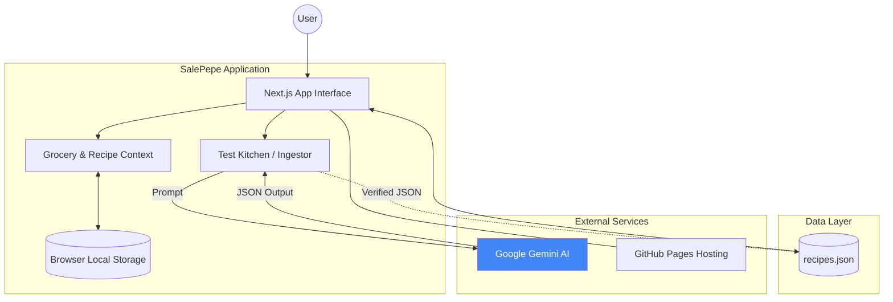
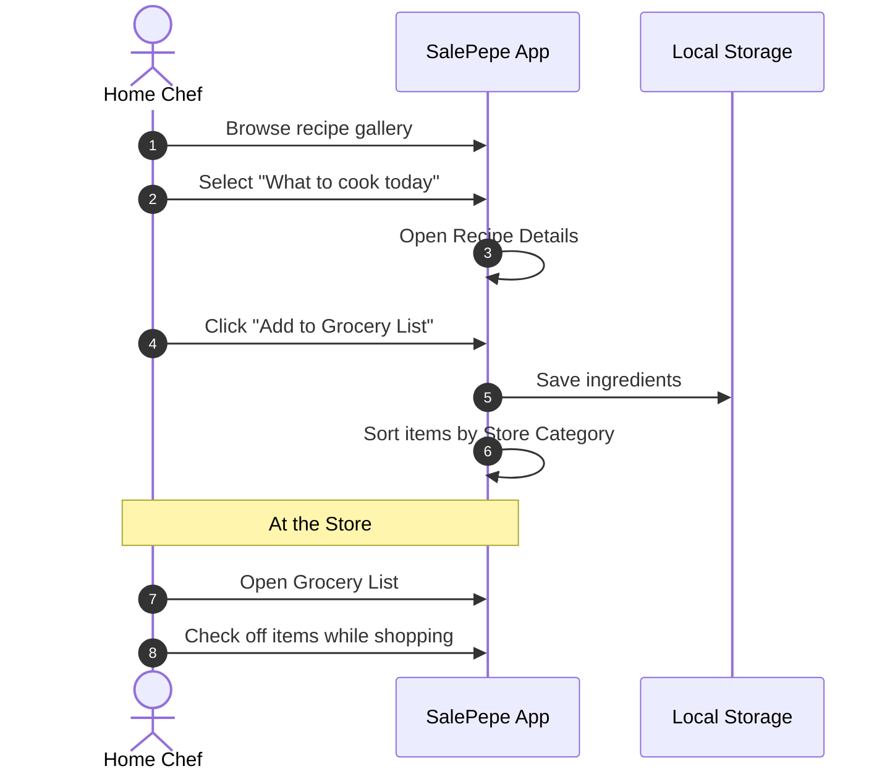
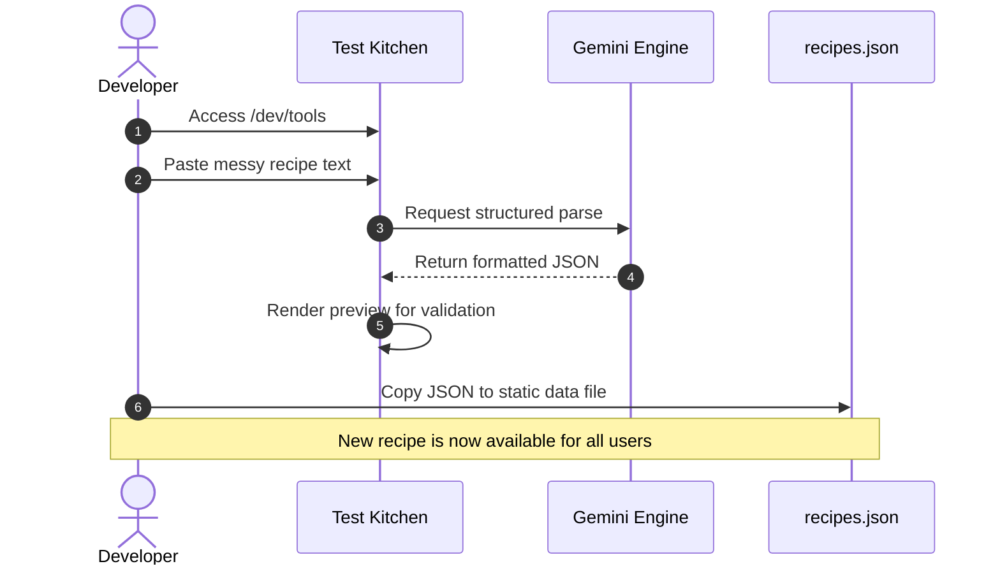

# SalePepe

### *Your Personal Kitchen Command Center*

SalePepe is a lightweight, home-focused app designed to answer the age-old question: **"What's for dinner?"** It helps you browse your favorite recipes, instantly build a shopping list, and quickly save new inspiration you find online without the manual data entry.

## How to use SalePepe every day

### 1. Decide what to cook

Search through your existing library of recipes.

### 2. Make your Grocery List

Found the dish you like? Add the ingredients to your list with one click.

### 3. Import New Recipe

When you find a recipe on Instagram, a blog, or a random text from a friend. Paste the messy text or URL, and the AI extracts the ingredients and steps for you in a JSON format.

#### System Diagram


#### User workflow


#### Developer workflow



## Quick Setup

To use the AI importer, add your Google AI key to a file named `.env.local`:

```bash
NEXT_PUBLIC_GEMINI_API_KEY=your_key_here
```

Install the project on your machine. Run the command below and open your browser to `localhost:3000`:

```bash
npm install
npm run dev
```
